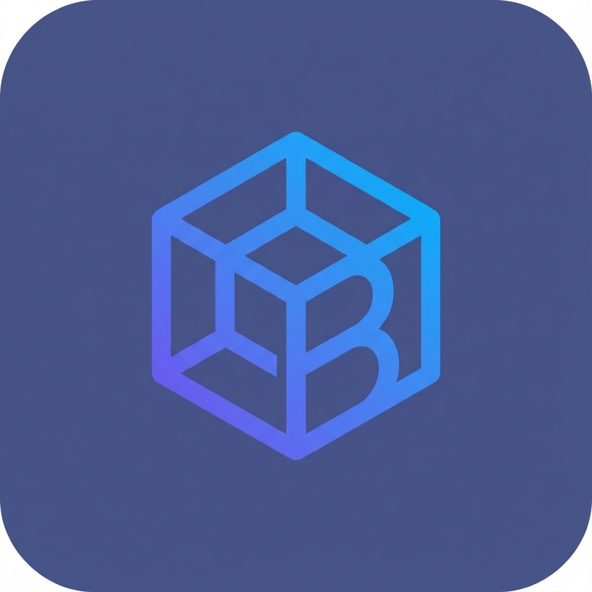

<p align="center">
  
</p>

<h1 align="center">Balaji Inventory App</h1>

<p align="center">
  <strong>AI-powered voice assistant for real-time inventory management</strong>
</p>

<p align="center">
  
  
  
  
  
  
</p>

---

A mobile-first inventory management system built for **Balaji Cleaning Products Ltd. (BCPL)**. The standout feature is a **voice-first AI agent** that lets warehouse staff manage stock, query inventory, and track orders — entirely hands-free, in Hindi or English.

## ✨ Key Features

### 🤖 AI Voice Agent (Star Feature)

The AI agent is a fully integrated, voice-first assistant designed for hands-free warehouse operations:

| Capability | Description |
|---|---|
| 🎙️ **Voice Input** | Speak naturally in **Hindi or English** — the agent understands both |
| 🔍 **Smart Inventory Search** | Ask _"Kitna Harpic bacha hai?"_ and get instant stock levels |
| 📦 **Stock Updates** | Say _"Add 50 kg cake to factory"_ — with confirmation before write |
| 📋 **Order Queries** | _"Show me pending orders"_ returns filtered results instantly |
| 🔊 **Voice Response** | Agent speaks back with natural TTS — true conversational UX |
| 🧠 **Context Memory** | Multi-turn conversations — the agent remembers what you just asked |
| ⚡ **Real-time Streaming** | WebSocket mode for low-latency, streaming audio responses |

### 📱 Mobile App
- **Dashboard** with real-time stock overview and announcements
- **Stock Management** across Shop and Factory locations
- **Order Tracking** with image attachments and status management
- **Price List** management with search and CRUD operations
- **User Management** with role-based access control
- **Push Notifications** via Expo Notifications

---

## 🏗️ Architecture

```
┌─────────────────────────────────────────────────────────────────────┐
│                        React Native (Expo)                         │
│  ┌──────────┐  ┌──────────┐  ┌──────────┐  ┌────────────────────┐ │
│  │Dashboard │  │  Stock   │  │  Orders  │  │   Voice Agent UI   │ │
│  └──────────┘  └──────────┘  └──────────┘  └─────────┬──────────┘ │
└──────────────────────────────────────────────────────┼────────────┘
                         │  REST API / WebSocket        │
                         ▼                              ▼
┌─────────────────────────────────────────────────────────────────────┐
│                      Express.js Backend                             │
│                                                                     │
│  ┌──────────────────── AI Agent Pipeline ──────────────────────┐   │
│  │                                                              │   │
│  │   🎙️ Audio ──► Groq Whisper ──► Gemini Flash ──► ElevenLabs │   │
│  │      Input       (STT)         (LLM + Tools)      (TTS)     │   │
│  │                                     │                        │   │
│  │                                     ▼                        │   │
│  │                              Function Calls                  │   │
│  │                                     │                        │   │
│  └─────────────────────────────────────┼────────────────────────┘   │
│                                        │ MCP Protocol (stdio)       │
│                                        ▼                            │
│  ┌──────────────────────────────────────────────────────────────┐   │
│  │                    MCP Tool Server                           │   │
│  │  ┌────────────────┐ ┌────────────────┐ ┌─────────────────┐  │   │
│  │  │inventory_search│ │inventory_update│ │  orders_list    │  │   │
│  │  │ (fuzzy match)  │ │  (with RBAC)   │ │ (filter/sort)   │  │   │
│  │  └────────────────┘ └────────────────┘ └─────────────────┘  │   │
│  └──────────────────────────────────────────────────────────────┘   │
│                                        │                            │
└────────────────────────────────────────┼────────────────────────────┘
                                         │
                                         ▼
                                ┌─────────────────┐
                                │    MongoDB       │
                                │  Atlas Cluster   │
                                └─────────────────┘
```

### AI Agent Pipeline in Detail

1. **Speech-to-Text** — [Groq](https://groq.com/) runs `whisper-large-v3-turbo` for ultra-fast transcription
2. **LLM Reasoning** — [Google Gemini Flash Lite](https://ai.google.dev/) processes the query with function calling. The system prompt is tuned for short, voice-friendly responses
3. **Tool Execution** — When Gemini decides to call a tool (e.g., `inventory_search`), the backend routes it to the **MCP Server** via the [Model Context Protocol](https://modelcontextprotocol.io/). The MCP server runs tools against MongoDB with smart features:
   - **Fuzzy search** using Levenshtein distance (handles typos like _"Harpik"_ → _"Harpic"_)
   - **RBAC enforcement** on write operations
   - **Ambiguity resolution** when multiple items match
4. **Text-to-Speech** — [ElevenLabs](https://elevenlabs.io/) generates natural voice responses streamed back to the app
5. **WebSocket Mode** — For real-time conversations, the agent supports full-duplex WebSocket streaming with chunked audio delivery

---

## 🛠️ Tech Stack

| Layer | Technology |
|---|---|
| **Mobile App** | React Native 0.81, Expo 54, Expo Router, TypeScript |
| **Backend API** | Node.js, Express 5, JWT Authentication |
| **AI / LLM** | Google Gemini Flash Lite (reasoning + function calling) |
| **Speech-to-Text** | Groq Whisper Large V3 Turbo |
| **Text-to-Speech** | ElevenLabs Flash V2.5 |
| **Tool Server** | MCP Server (Model Context Protocol), TypeScript |
| **Database** | MongoDB Atlas, Mongoose 9 |
| **Real-time** | WebSocket (ws) for streaming voice agent |
| **Deployment** | Render (backend), EAS (mobile builds) |

---

## 🚀 Getting Started

### Prerequisites

- **Node.js** >= 18
- **MongoDB** (local or Atlas connection string)
- **Expo CLI** (`npm install -g expo-cli`)

### 1. Clone & Install

```bash
git clone https://github.com/ARPITJ0SHI/Inventory-App--BCPL.git
cd Inventory-App--BCPL
```

### 2. Backend Setup

```bash
cd server
npm install

# Create .env file
cp .env.example .env   # or create manually
```

Add the following to `server/.env`:

```env
MONGODB_URI=mongodb://localhost:27017/balaji-app
JWT_SECRET=your-secure-jwt-secret
PORT=5000
SUPER_ADMIN_PASSWORD=your-super-admin-password

# AI Agent Keys (required for voice agent)
GEMINI_API_KEY=your-gemini-api-key
GROQ_API_KEY=your-groq-api-key
ELEVENLABS_API_KEY=your-elevenlabs-api-key    # optional, TTS disabled without it
```

### 3. MCP Server Setup

```bash
cd ../mcp-server
npm install
npm run build          # Compiles TypeScript → dist/
```

### 4. Start Backend

```bash
cd ../server
npm run dev            # Starts Express + auto-spawns MCP server
```

### 5. Frontend Setup

```bash
cd ../frontend
npm install
npx expo start         # Scan QR with Expo Go
```

> Update the API URL in `app.json` → `extra.apiUrl` to point to your backend.

---

## 📁 Project Structure

```
├── frontend/                # React Native (Expo) mobile app
│   ├── app/
│   │   ├── (auth)/          # Login & Registration screens
│   │   ├── (tabs)/          # Main app tabs
│   │   │   ├── index.tsx    #   Dashboard
│   │   │   ├── stock.tsx    #   Stock management
│   │   │   ├── orders.tsx   #   Order tracking
│   │   │   ├── pricelist.tsx#   Price list CRUD
│   │   │   ├── voice.tsx    #   🤖 AI Voice Agent screen
│   │   │   └── profile.tsx  #   User profile
│   │   └── orders/          # Order detail views
│   ├── components/          # Reusable UI components
│   └── src/                 # Services, hooks, utilities
│
├── server/                  # Express.js backend
│   ├── routes/
│   │   ├── agentRoutes.js   # 🤖 AI agent REST endpoint (STT→LLM→TTS)
│   │   ├── agentWebSocket.js# 🤖 Real-time WebSocket agent
│   │   ├── authRoutes.js    # JWT authentication
│   │   ├── stockRoutes.js   # Stock CRUD
│   │   ├── orderRoutes.js   # Order management
│   │   └── ...
│   ├── services/
│   │   └── mcpClient.js     # MCP client (spawns & communicates with MCP server)
│   ├── middleware/           # Auth middleware
│   └── models/              # Mongoose schemas
│
├── mcp-server/              # Model Context Protocol tool server
│   └── src/
│       ├── index.ts         # 🤖 MCP tools (search, update, orders, count)
│       ├── db.ts            # MongoDB connection
│       └── models.ts        # Shared Mongoose models
│
└── render.yaml              # Render deployment config
```

---

## 🔐 Role-Based Access

| Role | Stock View | Stock Edit | Orders | Users | AI Agent |
|---|---|---|---|---|---|
| `super_admin` | ✅ | ✅ | ✅ | ✅ | ✅ |
| `khushal` | ✅ | ✅ | ✅ | ❌ | ✅ |
| `factory_manager` | ✅ | ✅ | ✅ | ❌ | ✅ |
| `shop_manager` | ✅ | ✅ | ✅ | ❌ | ✅ |

---

## 🌐 Deployment

The app is configured for **Render** (backend) and **Expo EAS** (mobile):

```bash
# Backend: auto-deploys from render.yaml
# Mobile: build with EAS
cd frontend
eas build --platform android
```

---

## 📄 License

ISC

---

<p align="center">
  Built with ❤️ for <strong>Balaji Cleaning Products Ltd.</strong>
</p>
